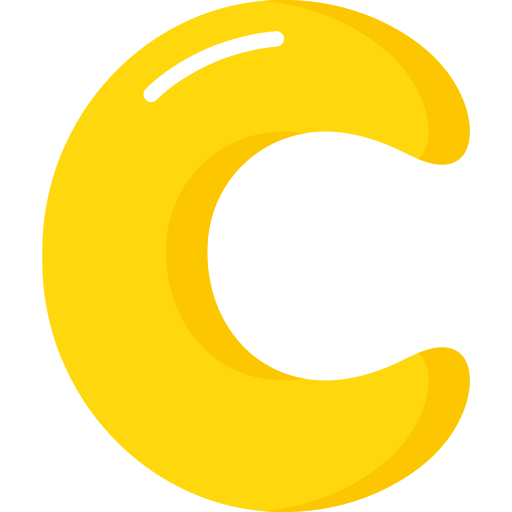

# C-learning
I am using this repository to document my learning about C.
## What is C?
C is a programming language used to design computer software and application.
## Why do we use C?
We use the C programming language to design computer software and applications.
## Who invented C?
C Programming Language was invented in the year 1972 by Dennis Ritchie (Dennis MacAlistair Ritchie). He was an American Computer Scientist worked at Bell Labs as a researcher along with Ken Thompson. He was born on 9th September 1941 and lived till 12th October 2011. He is said to be the Father of C.

## Table of Contents

   - [1. Header Files](https://github.com/gauravkr17/C-Learning/tree/master/Chapters/Header_Files)
   - [2. Hello World](https://github.com/gauravkr17/C-Learning/tree/master/Chapters/HelloWorld)
   - [3. Variables]()
   - [4. Constants]()
   - [5. Storage Class]()
   - [6. Input Output]()
   - [7. Operators]()
   - [8. Decision Making]()
   - [9. Loops]()
   - [10. Functions]()
   - [11. Recursion]()
   - [12. Arrays]()
   - [13. Strings]()
   - [14. String Literals]()
   - [15. Typedef]()
   - [16. Pointers]()
   - [17. Memory Management]()
   - [18. Structure]()
   - [19. Unions]()
   - [20. Enumm]()
   - [21. Bit Fields]()
   - [22. Command Line Args]()
   - [23. Variable Args]()
   - [24. File I/O]()
   - [25. Preprocessors]()
   - [26. Scope Rules]()
   - [27. Type Casting]()
   - [28. Absolute Value]()
   - [29. Structure Padding And Packking]()
   - [30. Error Handling]()
   - [Miscellaneous 1]()
   - [Miscellaneous 2]()
   - [Miscellaneous 3]()
   - [Miscellaneous 4]()
   - [Miscellaneous 4]()

[Go to top](#top)
